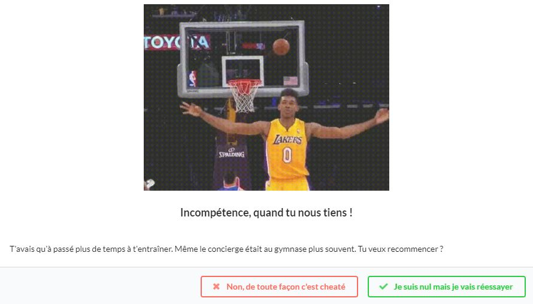

# 

Ça y est, ton rêve est sur le point de se réaliser, tu vas être drafté en NBA.

## But du jeu

La pérennité de ta carrière dépendra de tes choix. Ces derniers affecteront 5 variables: ta notoriété, ta réputation, ta forme physique, tes compétences ainsi que ton argent.

## Principe

La moitié des questions qui te seront posées dépendront de tes choix aux questions précédentes.
Si tu arrives au bout des questions, tu as gagné. En revanche, si une des variables tombe à 0%, tu as perdu.

## Scénarios

Tu as gagné :

Tu as perdu à cause de ta notoriété :

Tu as perdu à cause de ta réputation :

Tu as perdu à cause de ta forme physique :

Tu as perdu à cause de ton incompétence :

Tu as perdu à cause de ta mauvaise gestion de l'argent :

